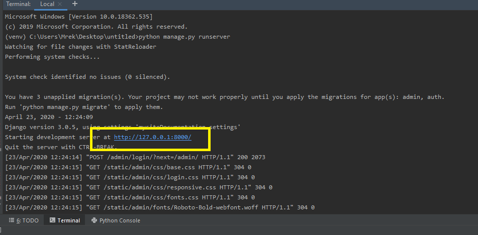
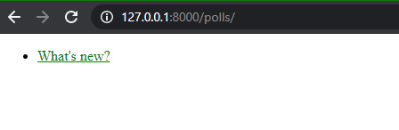
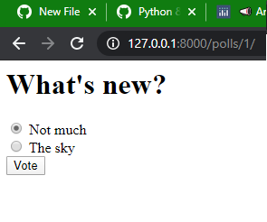
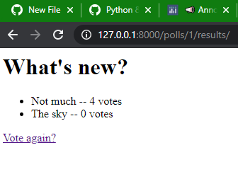

# Polls-app-django-tutorial-
This is simple polls app. I used official documentation.

# Installation
1. Use git clone or download manually
2. Install Django framework.
   > pip install django
2. Create new database. if you want to use an already created database, just go to next step
     > python manage.py makemigrations polls

  
     > python manage.py migrate polls
  
  
  >python manage.py createsuperuser 
  
  
  Create a admin account.
  
  
3. Run in terminal python manage.py runserver, copy adress and paste to browser

If you create new databese, go to  http://127.0.0.1:8000/admin/
  
  login and set new question

4. That's all

